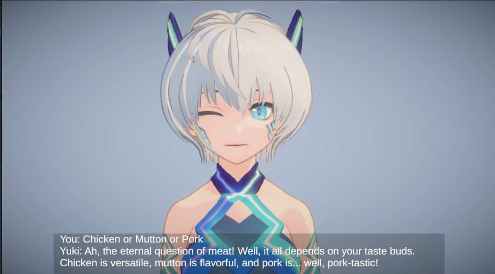

# Yuki:Personal-Assistant

Yuki is an anime style Personal Chatbot  
– Features a Japanese-speaking chatbot with an anime voice, complemented by English subtitles.  
– Yuki’s facial expressions dynamically change to match its responses, enhancing user engagement.  
– Talk to the assistant using a microphone or by simply providing text prompts.  
– Technology Used: Unity, REST APIs, Python, ChatGPT API, Prompt Engineering.

## Installation and Usage

1. Clone this repo, add the Personal Assistant directory in your Unity Project
2. Create a .env file inside the "server" directory and enter your openai api key
```bash
  OPENAI_API_KEY="Your API key here"
```
3. Voicevox engine is required. You can download it [here](https://github.com/VOICEVOX/voicevox_engine/releases/)
4. Run Voicevox engine by launching run.exe
5. Run the server by typing the following command
```bash
  python main.py 
```
6. Launch the assistant and engage in a conversation 😉!


  
  
  
